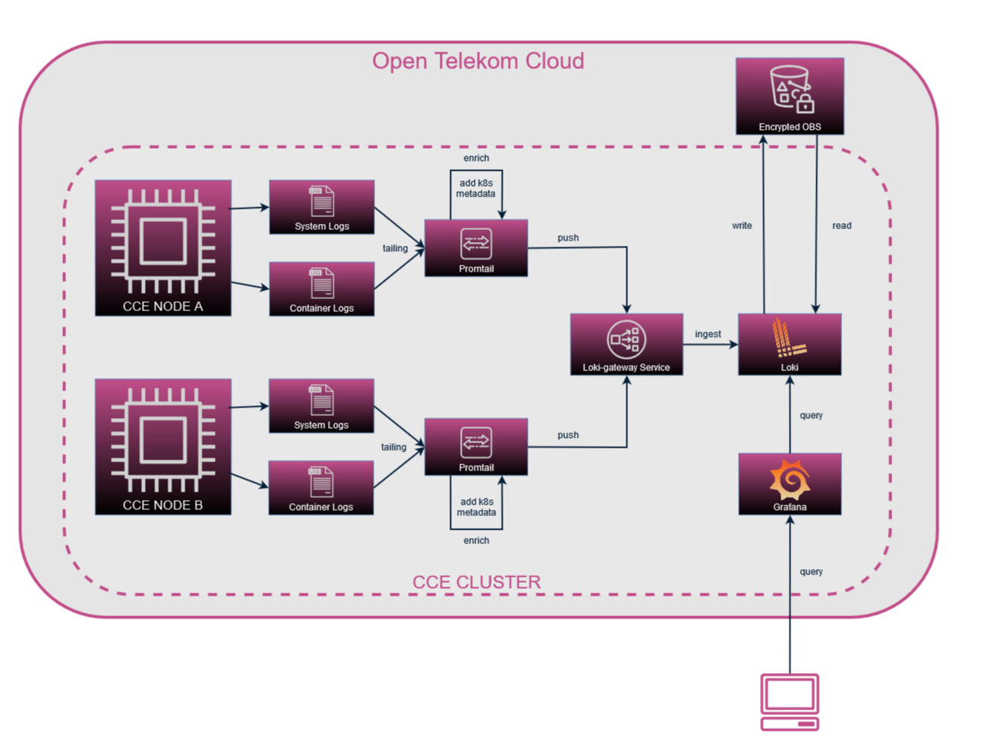

# Loki-stack
Loki, Promtail, and Grafana are designed for efficient log aggregation and visualization. Loki, a horizontally scalable log storage system, seamlessly integrates with Promtail, a lightweight log shipper, while Grafana provides a user-friendly interface for exploring and analyzing log data, making the Loki Stack a robust solution for centralized logging and monitoring.  
In this stack we will use an encrypted OBS bucket for Loki backend.



### Grafana
- deployed as a `statefulset` with 1 replicas
- uses `EVS` `PVC` for persistance
- `ingress` is disabled(commented out) by default. Can be configured at `charts/grafana/values.yaml`

### Loki
- deployed in monolithic mode with 2 `statefulset` replicas
- uses `EVS` `PVC` for persistance and caching
- uses encrypted `OBS` to store indexes and log chunks
- supports lifecycle policies via `compactor` and `limits_config`

### Promtail
- deployed as a `deamonset`
- forwards `pod` and `node` logs to `loki-gateway`

### OBS
- encrypted `OBS` bucket for loki to store indexes and chunks
- supports lifecycle policy via `index_expiration` terraform variables

### RBAC
- OTC user with the minimum amount of roles needed to access the encrypted OBS bucket

# Dependencies

### Infrastructure
- Required:
  - CCE cluster with autoscaling
  - Internet access from VPC
- Optional:
  - Configured `docker/config.json` to create `regcred` secret to avoid dockerhub throttling.

### Packages
- [terraform](https://developer.hashicorp.com/terraform/tutorials/aws-get-started/install-cli)
- [helm3](https://helm.sh/docs/intro/install/)
- [helmfile](https://helmfile.readthedocs.io/en/latest/#installation)
- [jq](https://jqlang.github.io/jq/download/)
- [otc-auth](https://github.com/iits-consulting/otc-auth)
- [tfenv](https://github.com/tfutils/tfenv)
- [kubectl](https://github.com/kubernetes/kubernetes/blob/master/CHANGELOG/CHANGELOG-1.25.md#client-binaries)

### Packages Dockerfile alternative
You need these packages installed. If you don't want to install them on your local machine you can use the `Dockerfile` to build an environment for the deployment:
```bash
docker build --no-cache=true --build-arg BUILD_DATE=$(date -u +'%Y-%m-%dT%H:%M:%SZ') --tag loki-deployer:latest .
docker run -it -v$(pwd):/deploy -v$HOME/.docker/config.json:/root/.docker/config.json -v$HOME/.kube/config:/root/.kube/config loki-deployer:latest
```


# How to deploy the stack

### Deploy `cloud_services`
- RBAC for loki to write OBS
- Encrypted OBS bucket
- KMS keys

1. Set up environment variables for terraform in `.envrc`
```bash
# update .envrc first
source .envrc && source get_token.sh
```
2. Set up OBS backend for terraform  
```bash
tfenv install
terraform  -chdir=./cloud_services/tf_backend init && terraform -chdir=./cloud_services/tf_backend apply
```
3. Deploy `cloud_services`  
  
```bash
#Set the Loki bucket name and file retention time(OBS lifecycle for indexes) for cloud_services
echo "s3_chunks = \"MY_BUCKET_NAME\"" > cloud_services/terraform.tfvars
echo "index_expiration = 100" >> cloud_services/terraform.tfvars
terraform -chdir=./cloud_services init && terraform -chdir=./cloud_services apply
```  

### Deploy on CCE
1. Create `regcred` secret (optional). If you skip this you have to remove `imagePullSecrets` from the helm values.
```bash
kubectl create ns logging
kubectl create secret generic regcred  --from-file=.dockerconfigjson=$HOME/.docker/config.json --type=kubernetes.io/dockerconfigjson -n logging
kubectl patch storageclass csi-disk-topology -p '{"metadata": {"annotations":{"storageclass.kubernetes.io/is-default-class":"true"}}}'
```
2. Set up environment variables for Loki deployment
```bash
source get_loki_creds.sh
```  
3. Deploy the stack
```bash
helmfile sync
```

### Useful stuff

- Get grafana admin password
```bash
kubectl get secret --namespace logging grafana -o jsonpath="{.data.admin-password}" | base64 --decode ; echo
```

```bash
kubectl port-forward svc/grafana 8080:80 -n logging
```

# Uninstall the stack
```bash
helmfile destroy && kubectl delete pvc --all -nlogging
terraform -chdir=./cloud_services destroy
terraform -chdir=./cloud_services/tf_backend destroy
#KMS keys will be removed after 1 week grace period
```
